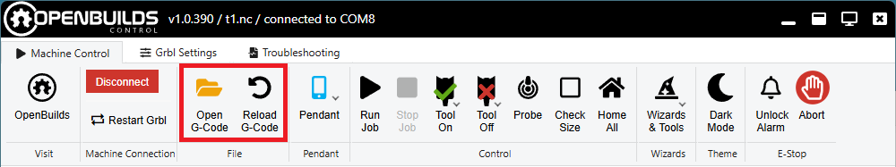
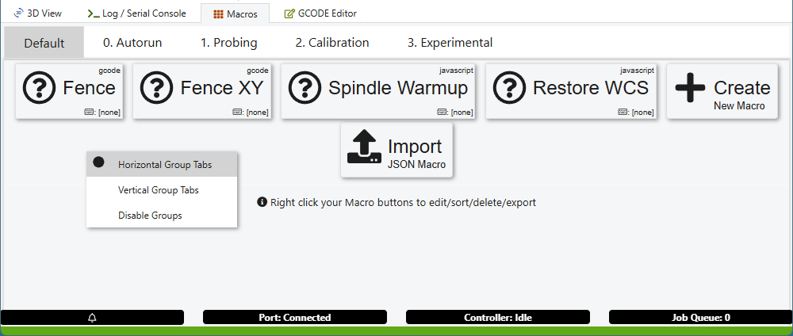
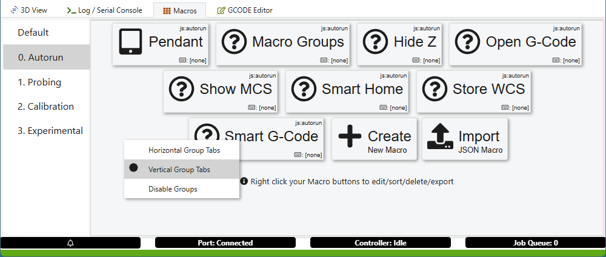

# Useful macros for OpenBuilds CONTROL

In this folder I keep a collection of useful Javascript macros.

All except OpenFile work with the stock OpenBuilds software.

## DisableZ
Disables the Z up/down buttons when the jog step is at the highest setting.
This prevents accidental Z jogs that can plunge into the table.
It is based on the original script by sharmstr - https://github.com/sharmstr/OpenBuildsHacks/blob/main/Macros/HideZBtns.js

Run it automatically on startup.

## StoreWcs/RestoreWcs
Set the StoreWcs to run on startup. It will record the WCS offset after each job.

Then use RestoreWcs to restore the offset if it is ever lost, like if you accidentally click Set 0.
This happened to me too many times, so I decided to do something about it.

## SmartHome
Prevents accidental homing if the machine was recently homed.

Relies on the **homedRecently** status of OpenBuilds.

Best when used in combination with the new "Disable Aggressive Home Reset" setting that exists in this version of OpenBuilds.
Without that setting, the **homedRecently** status is cleared after every benign alert, making it not very useful.

## OpenFile
Removes the dropdown from the file button and adds a dedicated reload button.

Based on https://thayneco.com/single-click-to-open-a-file-browser-in-openbuilds-control/

Requires this version of OpenBuilds, which adds the "reload" functionality.

## MacroGroups
Allows macro buttons to be organized in groups, which makes large number of macros more manageable.
The group tabs can be horizontal or vertical.

It works best when set to autorun on startup.

**Horizontal group tabs**

**Vertical group tabs**

## Spindle Delay
Pauses the execution after M3 and M4 commands without using the G4 G-code. Useful on some machines where G4 is not working properly.

Requires OpenBuilds v1.0.371 or later.

## SmartGCode
Few useful features for the currently loaded G-code file
* Restores the rapid moves that are stripped by the free version of Fusion 360 (not necessary if you have a postprocessor that does this at export time)
* Warns when a file with a different tool is loaded: reminder to replace the tool and probe it
* Warns if the G-code will fall below the minimum Z for the machine: prevents failures in the middle of the job if the tool stickout is too short
* Adds a pause after turning on the spindle: useful for VFD spindles that take time to spin up

The macro is intended to be used with the [Controlinator 3000 pendant](https://github.com/ivomirb/Controlinator-3000)
